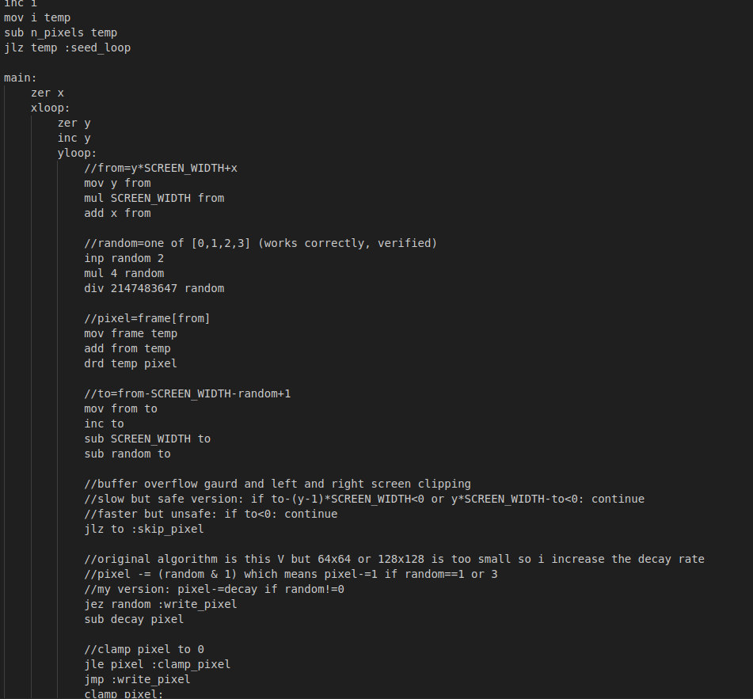
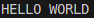
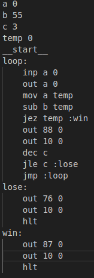
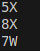

    
    <h1>Sublanq (WIP)</h1>

Sublanq is a high-level language compiler for the Subleq (Subtract and Branch if Less than or Equal to Zero) architecture. 
It features a syntax similar to the B programming language and compiles down to highly optimized Subleq machine code.

## Why?
### Opportunity
Subleq is an OISC (One Instruction Set Computer) architecture. 
Despite its theoretical elegance, the development ecosystem is lacking. 
The only existing high-level compiler, hsq, is currently abandonware. 
Furthermore, it is highly inefficient; hsq generates over 5,500 instructions for a standard "Hello World" program with printf and over 1000 with manual putchar (only 32 instructions needed). 
The Sublanq assembler demonstrates that this can be achieved in under 60 instructions.
There is a clear need for a modern, optimizing compiler that respects the resources of the host machine.

### Advantages
Subleq offers unique advantages for extreme minimalism:
- Simplicity: The instruction set architecture (ISA) consists of a single instruction. 
This allows for an extremely simple CPU design with a minimal transistor count, making it viable for microscopic applications (e.g., nanobots) or embedded environments with severe constraints.
- Efficiency: Modern CPUs spend significant power, die space and cycles on instruction decoding, branch prediction, call stacks, and out-of-order execution logic. 
Subleq removes this entirely. The logic gates saved can be used to minimize the chip size.
- Fixed Memory Footprint: Unlike stack-based architectures (such as Uxn or Forth), Subleq programs and data reside in a unified memory space. 
This ensures the memory footprint is constant and predictable at compile time, eliminating the risk of stack overflows or dynamic allocation errors.
- Resilience: The simplicity and self-contained nature of OISC systems make them ideal candidates for "apocalypse machines" or fantasy consoles, where hardware must be understandable, reproducible, and durable.
- Parallelism and Pipelining: Because a Subleq core is incredibly small, a single chip can host a massive array of cores. Furthermore, because instruction timing is uniform (no complex micro-ops), the pipeline is easy to implement and predict.

### Optimization
To maximize the performance of hardware we can:
- Wide-Fetch Architecture: To minimize memory cycles, the hardware should fetch the entire instruction trio (A, B, C) in a single cycle.
- SRAM Utilization: Using fast on-die SRAM reduces the power cost of memory operations, making the energy consumption comparable to register-based operations on standard CPUs.

### I/O Architecture
Sublanq utilizes a Port-Mapped I/O strategy rather than Memory-Mapped I/O or Interrupts. This design choice is critical for minimizing transistor count and maximizing versatility.
- Mechanism: Standard Subleq instructions use the C operand as a jump target. When the A or B operand refers to the null address (-1), the CPU repurposes the C operand as a Port ID (Device Selector).
- Why not Memory-Mapped I/O? Mapping hardware devices to RAM addresses complicates the memory controller (requiring dual-porting or clock division), "pollutes" the address space, and locks I/O to specific hardware configurations.
- Why not Interrupts? Interrupts require complex state-saving logic and additional registers (stack pointers), which violates the OISC minimalism philosophy.
- The Advantage: By using the C operand as a Port ID, the CPU can address devices with a single simple logic gate (detecting -1), allowing for complex setups (e.g. using multiple port by the same device for different interpretation of the data) without changing the core CPU design.

## The Project
### The Compiler (Sublanq)
A high-level language compiler that targets the Subleq assembler.
- Syntax: Modeled after B, offering a typeless, word-based programming environment that maps naturally to the Subleq memory model.
- Efficiency: The primary goal of the compiler is to produce machine code that rivals hand-written assembly, drastically reducing the binary size compared to legacy tools.

### Emulator
A feature-full emulator with 128x128 palette screen and arrow keys input, tty output with full input support and a random number generator device. 

Run `make` to build

### The Assembler
A fully functional assembler designed to improve upon incomplete or unintuitive alternatives.
Features:
- Variables and Pointers: Native support for memory addressing and pointer logic.
- Arithmetic: Abstraction of the subtract-based logic into standard mathematical operations.
- I/O: Simple multi-port input and output handling.
- Control Flow: comprehensive support for labels and branching.
- Integrated Emulator: Includes a terminal-based emulator to run and debug code immediately after assembly.

### Assembly Instructions

The Sublanq assembler abstracts Subleq's single instruction into a comprehensive set of operations. 
The table below details the syntax and the Subleq Cost (the number of raw Subleq instructions generated).

Key:

addr: Memory Address (Variable)

imm: Immediate Value (Literal number)

*: Looped operation (Execution time scales with input size)

#### Arithmetic & Logic
| Instruction | Syntax | Cost | Description |
|-------------|--------|------|-------------|
| zer | zer addr | 1 | Zero out memory location |
| inc | inc addr | 1 | Increment value (+1) |
| dec | dec addr | 1 | Decrement value (-1) |
| sub | sub addr/imm addr | 1 | Subtract value |
| add | add addr/imm addr | 3 | Add value |
| neg | neg addr | 6 | Negate value |
| mod | mod addr/imm addr | 9* | Modulo |
| mul | mul addr/imm addr | 10* | Multiplication |
| div | div addr/imm addr | 13* | Integer division |

#### Control Flow
| Instruction | Syntax | Cost | Description |
|-------------|--------|------|-------------|
| jmp | jmp label | 1 | Unconditional jump |
| jle | jle addr label | 1 | Jump if addr <= 0 |
| jlz | jlz addr label | 5 | Jump if addr < 0 |
| jez | jez addr label | 8 | Jump if addr == 0 |

#### Memory & Pointers
| Instruction | Syntax | Cost | Description |
|-------------|--------|------|-------------|
| mov | mov addr/imm addr | 4 | Copy value to destination |
| drd | drd src dest | 8 | Dereference Read (dest = *src) |
| dwt | dwt val dest | 12 | Dereference Write (*dest = val) |

#### I/O & System
| Instruction | Syntax | Cost | Description |
|-------------|--------|------|-------------|
| inp | inp addr imm_port | 1 | Input |
| out | out addr/imm imm_port | 1 | Output |
| hlt | hlt | 1 | Halt execution |

## Screenshots

#### Doom fire

#### Simple hello world program

#### Simple number guess game

