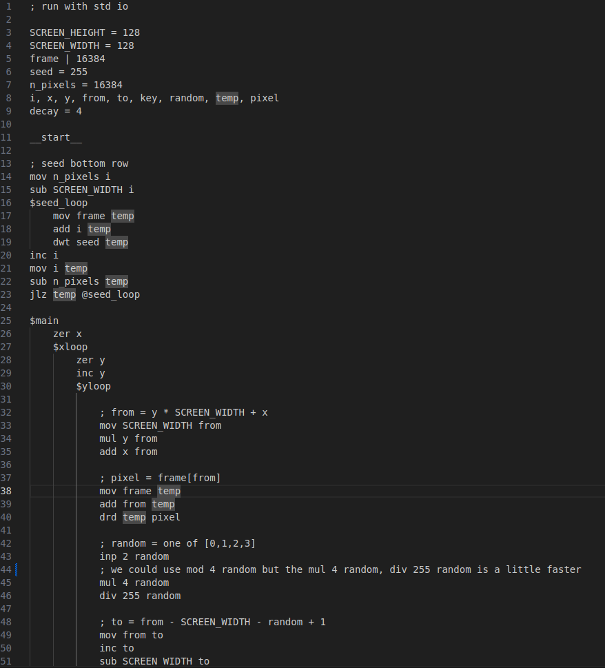
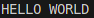
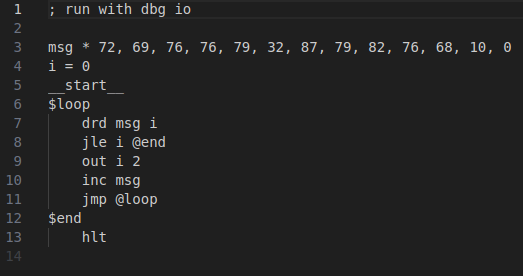

    
    <h1>Sublanq</h1>

Sublanq is an assembly-like language compiler for the Subleq (Subtract and Branch if Less than or Equal to Zero) architecture. 
It uses AT&T syntax and compiles down to highly optimized Subleq machine code.

## Why?
- Simplicity: The instruction set architecture (ISA) consists of a single instruction. 
This allows for an extremely simple CPU design with a minimal transistor count, making it viable for microscopic applications (e.g., nanobots) or embedded environments with severe constraints.
- Efficiency: Modern CPUs spend significant power, die space and cycles on instruction decoding, branch prediction, call stacks, and out-of-order execution logic. 
Subleq removes this entirely. The logic gates saved can be used to minimize the chip size.
- Fixed Memory Footprint: Unlike stack-based architectures (such as Uxn or Forth), Subleq programs and data reside in a unified memory space. 
This ensures the memory footprint is constant and predictable at compile time, eliminating the risk of stack overflows or dynamic allocation errors.
- Resilience: The simplicity and self-contained nature of OISC systems make them ideal candidates for "apocalypse machines" or fantasy consoles, where hardware must be understandable, reproducible, and durable.
- Parallelism and Pipelining: Because a Subleq core is incredibly small, a single chip can host a massive array of cores. Furthermore, because instruction timing is uniform (no complex micro-ops), the pipeline is easy to implement and predict.

### I/O Architecture
Sublanq utilizes a Port-Mapped I/O strategy rather than Memory-Mapped I/O or Interrupts. This design choice is critical for minimizing transistor count and maximizing versatility.
- Mechanism: Standard Subleq instructions use the C operand as a jump target. When the A or B operand refers to the null address (-1), the CPU repurposes the C operand as a Port ID (Device Selector).
- Why not Memory-Mapped I/O? Mapping hardware devices to RAM addresses complicates the memory controller, "pollutes" the address space which we already dont have enough of and locks I/O to specific hardware configurations.
- Why not Interrupts? Interrupts require complex state-saving logic and additional registers (stack pointers), which violates the OISC minimalism philosophy.
- The Advantage: By using the C operand as a Port ID, the CPU can address devices with a single simple logic gate (detecting -1), allowing for complex setups (e.g. using multiple port by the same device for different interpretation of the data) without changing the core CPU design.

## The Project
### Emulator
An emulator with 256x256 16-bit color screen and keyboard input for a minimal machine and more for standard and debug.

### The Assembler
- Variables, Pointers and allocations
- Arithmetic
- I/O
- Control Flow

### Assembly Instructions

The Sublanq assembler abstracts Subleq's single instruction into a comprehensive set of operations. 
The table below details the syntax and the Subleq Cost (the number of raw Subleq instructions generated).

Key:
- addr: Memory Address/Variable
- imm: Immediate Value
- *: Looped operation (Execution time scales with input size)

#### Arithmetic & Logic
| Instruction | Syntax | Cost | Description |
|-------------|--------|------|-------------|
| zer | zer addr | 1 | Zero out memory location |
| inc | inc addr | 1 | Increment value (+1) |
| dec | dec addr | 1 | Decrement value (-1) |
| neg | neg addr | 6 | Negate value |
| sub | sub addr/imm addr | 1 | Subtract value |
| add | add addr/imm addr | 3 | Add value |
| mul | mul addr/imm addr | 22* | Multiplication |
| div | div addr/imm addr | 33* | Integer division |
| mod | mod addr/imm addr | 28* | Modulo |

#### Control Flow
| Instruction | Syntax | Cost | Description |
|-------------|--------|------|-------------|
| jmp | jmp label | 1 | Unconditional jump |
| jle | jle addr label | 2 | Jump if addr <= 0 |
| jlz | jlz addr label | 5 | Jump if addr < 0 |
| jez | jez addr label | 6 | Jump if addr == 0 |
| jge | jez addr label | 4 | Jump if addr >= 0 |
| jgz | jez addr label | 3 | Jump if addr > 0 |
| sjp | sjp label addr | 4 | Store jump addr |
| ljp | ljp addr | 5 | Jump to derefernced addr |

#### Memory & Pointers
| Instruction | Syntax | Cost | Description |
|-------------|--------|------|-------------|
| mov | mov addr/imm addr | 4 | Copy value to destination |
| adr | adr addr_a addr_b | 4 | Put address of a in b |
| drd | drd src dest | 8 | Dereference Read (dest = *src) |
| dwt | dwt val dest | 12 | Dereference Write (*dest = val) |

#### I/O & System
| Instruction | Syntax | Cost | Description |
|-------------|--------|------|-------------|
| inp | inp addr imm_port | 1 | Input |
| out | out addr/imm imm_port | 1 | Output |
| hlt | hlt | 1 | Halt execution |

## Screenshots

### DOOM FIRE

### HELLO WORLD

